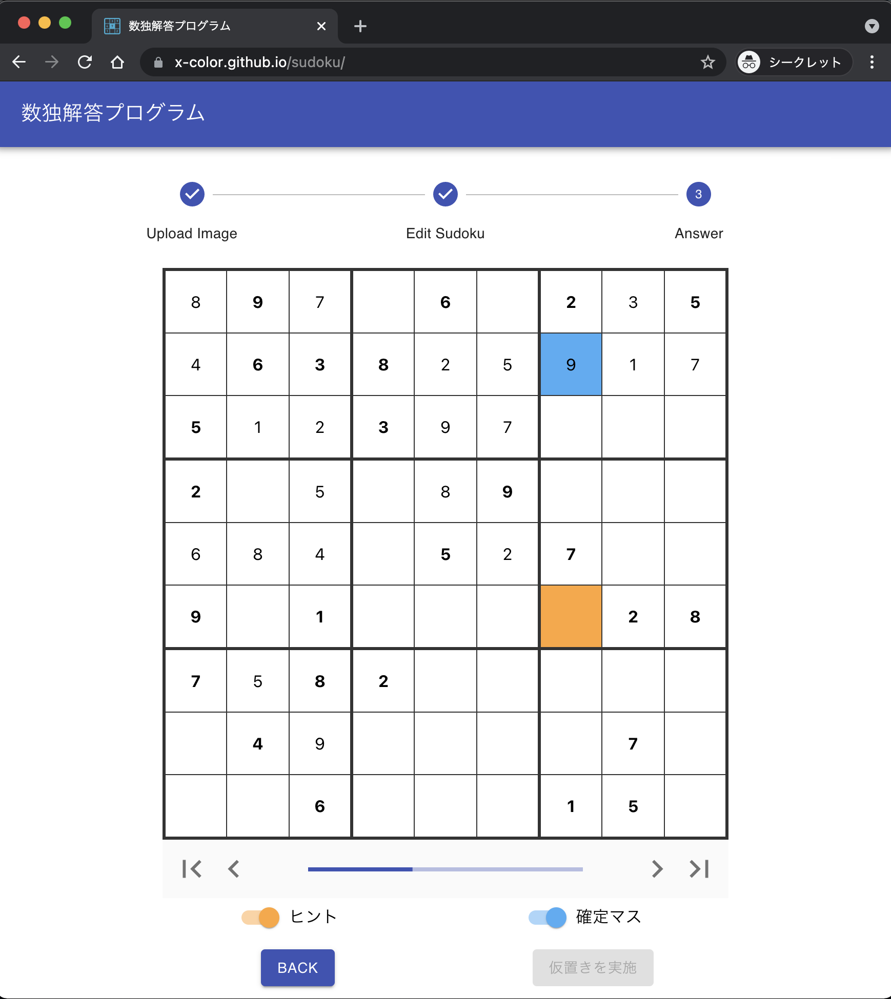

# Sudoku Solver

自動で数独を解いてくれる Web アプリケーション。
次にどこが埋まるのかなども表示する事が可能。

サイト → [数独解答プログラム](https://x-color.github.io/sudoku)

    

※オレンジ色のマスが次に埋まる場所。水色のマスが確定した場所

## できること

- 数独の写真から数独を自動で判別
- 手動で数独を入力
- 自動で数独を解く
- 次に埋まるマスを表示

## 技術要素

### 言語など

- Go
- TypeScript
- React
- Terraform
- OpenCV
- Tesseract

### インフラ

- Amazon API Gateway
- AWS Lambda
- AWS ECR
